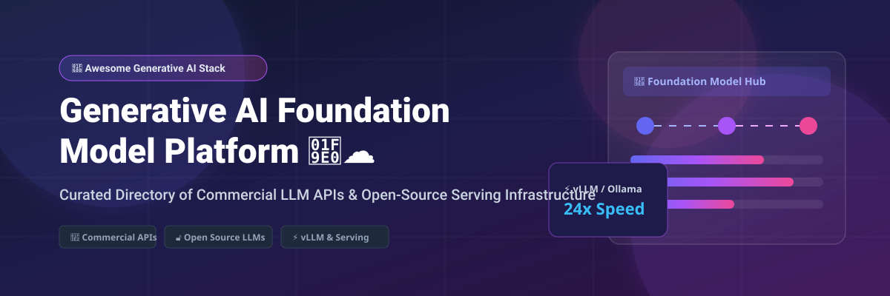

# Awesome-Generative-AI-Foundation-Model-Platform

# Awesome-Generative-AI-Foundation-Model-Platform 🧠 ☁️

  

  

  

  

  

  

  

---

## 🌟 Top Generative AI Foundation Model Platform Ecosystem

**Curated List of Commercial Foundation Model APIs & Open-Source Model Serving Frameworks**  

*Focused on LLM APIs, Multimodal Models, Model Serving, Fine-Tuning, Inference Optimization & Self-Hosted Foundation Models*

**Last updated: October 2026** 📅

---

### 📌 Overview & SEO Summary

Welcome to the ultimate curated directory of **generative AI foundation model platforms**, **open-source model serving frameworks**, and **inference optimization tools**. Whether you are looking for enterprise-grade commercial APIs (such as *Amazon Bedrock*, *OpenAI API*, and *Azure OpenAI Service*), or self-hostable open-source alternatives (like *vLLM*, *Ollama*, and *Text Generation Inference*), this list covers category leaders, model hubs, and privacy-respecting foundation model infrastructure.

**Key Market Context:**

- **Amazon Bedrock** is the **most comprehensive multi-model API**, providing access to **Anthropic Claude, Meta Llama, Mistral, Cohere, and Amazon Titan** through a single unified API.

- **vLLM** is the **leading open-source inference engine**, with **45K+ GitHub stars** and **PagedAttention** delivering **up to 24x higher throughput** than naive serving.

- **Ollama** is the **most accessible local LLM runner**, with **100K+ GitHub stars** and **one-command model deployment**.

---

## 📑 Table of Contents

- [🏢 SaaS & Commercial Platforms](#-saas--commercial-platforms)

- [🔓 Open-Source GitHub Projects](#-open-source-github-projects)

- [🛠️ How to Contribute](#%EF%B8%8F-how-to-contribute)

- [📊 Star History](#-star-history)

- [🤝 Support & Sponsorship](#-support--sponsorship)

- [⚠️ Disclaimer](#%EF%B8%8F-disclaimer)

---

## 🏢 SaaS / Commercial Platforms

The generative AI foundation model platform market spans **hyperscaler model APIs** (Amazon Bedrock, Azure OpenAI, Google Vertex AI) that provide **multi-model access with enterprise governance**, **frontier model providers** (OpenAI, Anthropic, Mistral) that offer **state-of-the-art proprietary models**, and **inference-optimized platforms** (Groq, Together AI, Replicate) that focus on **speed, cost, and model variety**. **Amazon Bedrock** uses **pay-per-token pricing** that varies by model . **OpenAI API** charges **$2.50/1M input tokens and $10/1M output tokens** for GPT-4o . **Azure OpenAI Service** uses **pay-per-token pricing** with **Azure enterprise integration** . **Groq** offers **LPU-based inference at $0.05–$0.27/1M tokens** . **Together AI** charges **$0.20–$0.90/1M tokens** depending on model size .

| SaaS / Commercial Platform | Company / Owner | Valuation / Market Cap | Standard Edition Starting Price | Free Tier / Free Trial Limits | Description |

| :--- | :--- | :--- | :--- | :--- | :--- |

| **[Amazon Bedrock](https://aws.amazon.com/bedrock/)** ☁️ | Amazon | ~$2.0 Trillion | **Pay-per-token** (varies by model) | **Free tier: limited** | **AWS-native multi-model API** — **Anthropic Claude, Meta Llama, Mistral, Cohere, Amazon Titan, and more** through a unified API . **Knowledge Bases for RAG** . **Agents for task automation** . **Guardrails for safety** . **Deep AWS integration** . |

| **[OpenAI API](https://platform.openai.com/)** 🤖 | OpenAI | ~$80 Billion | **GPT-4o: $2.50/1M input, $10/1M output** | **Free: limited credits** | **The most widely used LLM API** — **GPT-4o, GPT-4o mini, o1, and o3** . **Multimodal (text, image, audio, video)** . **Assistants API for agents** . **Fine-tuning available** . |

| **[Azure OpenAI Service](https://azure.microsoft.com/en-us/products/ai-services/openai-service)** 🔷 | Microsoft | ~$3.90 Trillion | **Pay-per-token** (varies by model) | **Free: limited credits** | **Azure-native OpenAI models** — **GPT-4o, GPT-4, and DALL-E** . **Enterprise security and compliance** . **Private networking and VNet integration** . **Content filtering and abuse monitoring** . |

| **[Google Vertex AI](https://cloud.google.com/vertex-ai)** 🌐 | Google (Alphabet) | ~$2.0 Trillion | **Pay-per-token** (varies by model) | **$300 free credits** for new customers | **GCP-native model platform** — **Gemini, PaLM, and third-party models** . **Model Garden with 100+ models** . **AutoML and custom training** . **Vertex AI Search and Conversation** . |

| **[Anthropic API](https://www.anthropic.com/)** 🟣 | Anthropic | ~$60 Billion | **Claude 3.5 Sonnet: $3/1M input, $15/1M output** | **Free: limited credits** | **Anthropic's Claude models** — **200K context window** . **Constitutional AI for safety** . **Tool use and vision capabilities** . **The most safe and reliable frontier model** . |

| **[Cohere Platform](https://cohere.com/)** 🔵 | Cohere | ~$5.5 Billion | **Pay-per-token** | **Free: trial keys** | **Enterprise NLP platform** — **Command, Embed, and Rerank models** . **Retrieval-augmented generation (RAG)** . **Fine-tuning and custom models** . |

| **[Mistral AI Platform](https://mistral.ai/)** 🟠 | Mistral AI | ~$6 Billion | **Pay-per-token** | **Free: limited credits** | **European frontier models** — **Mistral Large, Small, and Codestral** . **Open-weight models** available for self-hosting . **Function calling and JSON mode** . |

| **[Together AI](https://www.together.ai/)** ⚡ | Together AI | ~$3.3 Billion | **$0.20–$0.90/1M tokens** (varies by model) | **Free: $25 credits** | **Open-source model API** — **Llama, Mistral, and Qwen** . **Fast inference with FlashAttention** . **Fine-tuning and dedicated instances** . |

| **[Replicate](https://replicate.com/)** 🔬 | Replicate | ~$350 Million | **$0.0001–$0.01/second** (varies by model) | **Free: limited credits** | **Open-source model hosting** — **Run any model with a single API call** . **Thousands of community models** . **Image, video, audio, and text models** . |

| **[GroqCloud](https://groq.com/)** 🚀 | Groq | ~$2.8 Billion | **$0.05–$0.27/1M tokens** | **Free: limited rate limits** | **LPU-based inference** — **The fastest LLM inference available** . **Llama, Mixtral, and Gemma models** . **Ultra-low latency for real-time applications** . |

---

## 🔓 Open-Source GitHub Projects

*Sorted by GitHub_Stars_Count (Descending)* 🌟

- **[Ollama](https://github.com/ollama/ollama)**   

  **Get up and running with large language models locally**, MIT licensed. **100K+ GitHub stars** — **the most accessible local LLM runner** . **One-command model deployment** — `ollama run llama3` . **Supports Llama, Mistral, Gemma, Phi, and more** . **OpenAI-compatible API** . **The standard for local LLM inference** . 🦙

- **[vLLM](https://github.com/vllm-project/vllm)**   

  **High-throughput and memory-efficient LLM serving engine**, Apache-2.0 licensed. **45K+ GitHub stars** — **PagedAttention delivers up to 24x higher throughput** . **Continuous batching** for efficient GPU utilization . **Supports Llama, Mistral, Qwen, and more** . **OpenAI-compatible API** . **The standard for production LLM serving** . ⚡

- **[Text Generation Inference (TGI)](https://github.com/huggingface/text-generation-inference)**   

  **Hugging Face's production-grade LLM serving toolkit**, Apache-2.0 licensed. **10K+ GitHub stars** — **optimized inference with FlashAttention and PagedAttention** . **Token streaming and continuous batching** . **The standard for Hugging Face model serving** . 🤗

- **[llama.cpp](https://github.com/ggerganov/llama.cpp)**   

  **LLM inference in C/C++**, MIT licensed. **70K+ GitHub stars** — **runs on CPU, GPU, and Apple Silicon** . **GGUF quantization** for reduced memory footprint . **The foundation for Ollama and many local LLM tools** . **The most portable LLM inference engine** . 🦙

- **[Transformers (Hugging Face)](https://github.com/huggingface/transformers)**   

  **State-of-the-art ML for text, vision, and audio**, Apache-2.0 licensed. **130K+ GitHub stars** — **100K+ pretrained models** . **Unified API for all modalities** . **The de facto standard for using foundation models** . 🤗

- **[LangChain](https://github.com/langchain-ai/langchain)**   

  **Framework for developing LLM-powered applications**, MIT licensed. **90K+ GitHub stars** — **chains, agents, and RAG pipelines** . **Model-agnostic** — supports OpenAI, Anthropic, and local models . **The most widely used LLM application framework** . 🔗

- **[LM Studio](https://github.com/lmstudio-ai/lmstudio)**   

  **Desktop app for running local LLMs**, open-source. **Discover, download, and run local LLMs** . **GGUF model support** . **OpenAI-compatible API server** . **The most user-friendly local LLM GUI** . 🖥️

- **[LocalAI](https://github.com/mudler/LocalAI)**   

  **OpenAI-compatible API for local inference**, MIT licensed. **30K+ GitHub stars** — **drop-in replacement for OpenAI API** . **Runs LLMs, image generation, and speech on consumer hardware** . **No GPU required** . 🖥️

- **[Open WebUI](https://github.com/open-webui/open-webui)**   

  **Self-hosted ChatGPT-style UI**, MIT licensed. **124K+ GitHub stars** — **supports Ollama, OpenAI-compatible APIs, MCP servers, and RAG** . **Multi-user RBAC and LDAP/SSO** . 🔒

- **[OpenLLMetry](https://github.com/traceloop/openllmetry)**   

  **OpenTelemetry-based observability for LLM applications**, Apache-2.0 licensed. **Tracing, metrics, and evaluation for AI/LLM applications** . **Vendor-neutral instrumentation** . 🔭

- **[FastChat](https://github.com/lm-sys/FastChat)**   

  **Platform for training, serving, and evaluating chatbots**, Apache-2.0 licensed. **The foundation for LMSYS Chatbot Arena** . **Supports Vicuna, FastChat-T5, and more** . 🏆

- **[LiteLLM](https://github.com/BerriAI/litellm)**   

  **Call 100+ LLMs with a single OpenAI-compatible API**, MIT licensed. **The universal LLM API proxy** . **Supports OpenAI, Anthropic, Azure, Bedrock, and more** . **The standard for multi-provider LLM integration** . 🔌

---

## 🛠️ How to Contribute

Contributions are welcome! Follow these steps to submit new foundation model platforms or open-source model serving software:

1. 🍴 **Fork** the repository.

2. 📝 **Add/edit** entries in `README.md` maintaining table/list structure and formatting.

3. 🔗 Include project title, official website/GitHub link, exact Stars_Count, license, and brief description.

4. 🚀 Submit a **Pull Request** with a descriptive summary of your changes.

---

## 📊 Star History

---

## 🤝 Support & Sponsorship

If you find this generative AI foundation model platform repository useful, please consider supporting the project:

- ⭐ **Star** this repository to increase visibility!

- 🔀 **Fork** and share with fellow AI engineers, ML practitioners, and open-source advocates.

- ☕ **Sponsor & Buy Me a Coffee**: Support ongoing open-source curation via the [GitHub Sponsor Dashboard](https://github.com/sponsors/ishandutta2007).

---

## ⚠️ Disclaimer

- This is a **community-curated** list — not exhaustive and not an endorsement. ℹ️

- **Amazon Bedrock provides multi-model access** through a unified API with **enterprise governance** . **OpenAI API charges $2.50/1M input and $10/1M output tokens for GPT-4o** . **Groq offers LPU-based inference at $0.05–$0.27/1M tokens** .

- **vLLM is the leading open-source inference engine** with **45K+ GitHub stars** and **PagedAttention delivering up to 24x higher throughput** . **Ollama is the most accessible local LLM runner** with **100K+ GitHub stars** and **one-command model deployment** .

- **Open-source foundation model platforms are not turnkey** — they require **GPU infrastructure, model management, and ongoing maintenance** . **vLLM requires NVIDIA GPUs for optimal performance** . **Ollama runs on CPU and GPU but performance varies** . **Always validate model quality, latency, and cost with a proof-of-concept** before production deployment . 🧠

---

  <b>Made with ❤️ for AI engineers, ML practitioners, and open-source foundation model advocates.</b>

